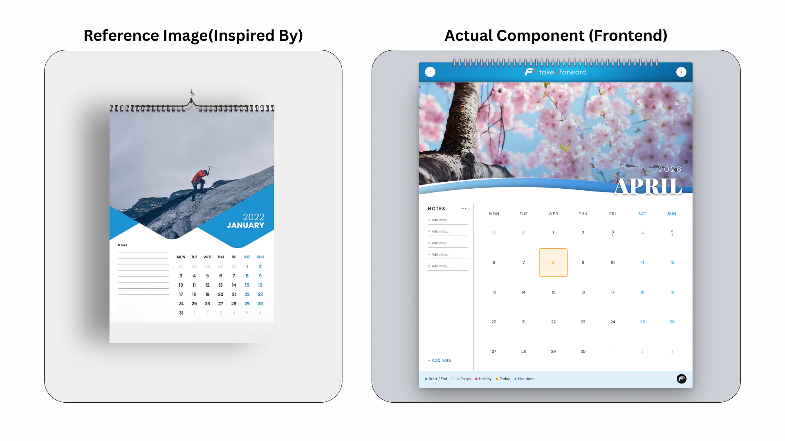
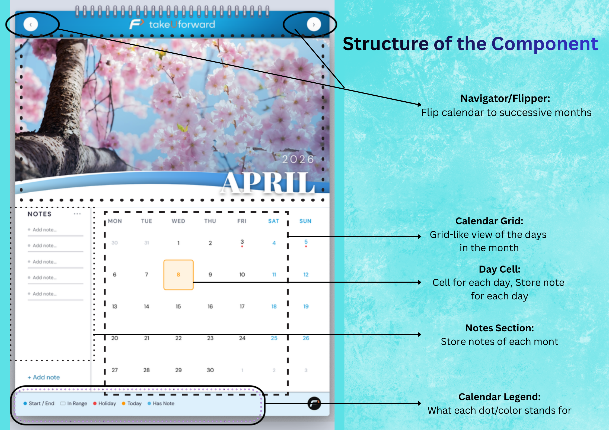
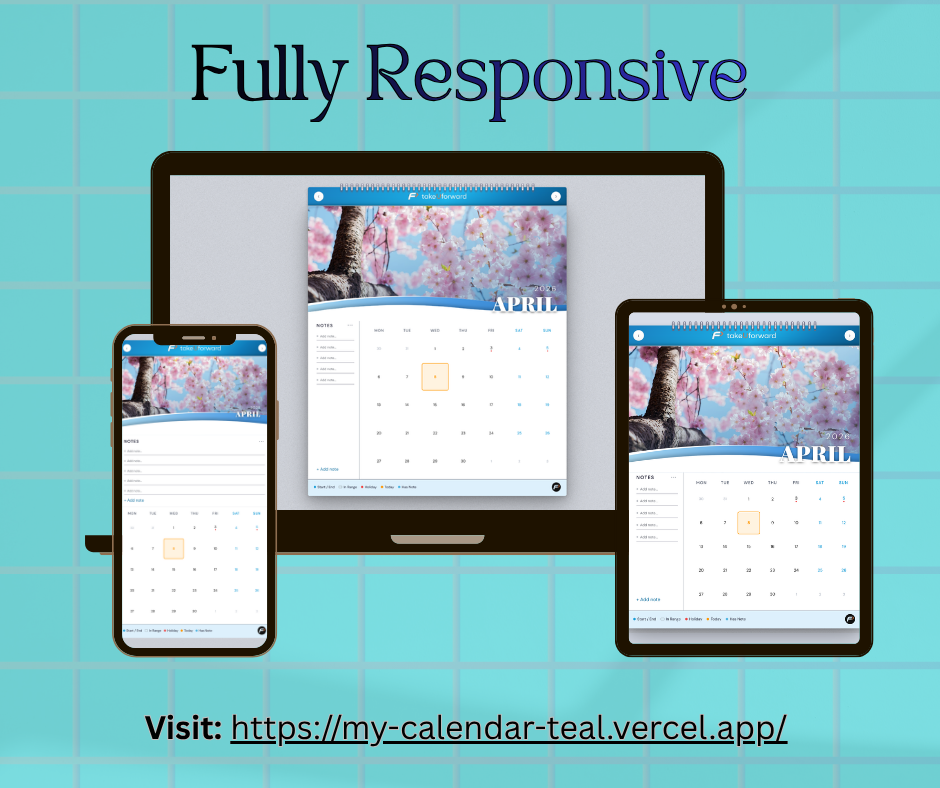

<div align="center">

<!-- Replace with your actual logo path -->


# Wall Calendar 2026 — Interactive Calendar Frontend

*Frontend Engineering Challenge — TakeUforward Internship Task*

</div>

---

<!-- Replace the path below with your actual screenshot or demo GIF -->


---

## Table of Contents

- [Overview](#overview)
- [Why Next.js over React?](#why-nextjs-over-react)
- [Features](#features)
- [Component Architecture](#component-architecture)
- [Hooks](#hooks)
- [Tech Stack](#tech-stack)
- [Getting Started](#getting-started)
- [Folder Structure](#folder-structure)
- [Design Decisions](#design-decisions)

---

## Overview

A polished, fully interactive **wall calendar web application** built as a frontend engineering challenge. It faithfully replicates the aesthetic of a physical wall calendar — complete with spiral binding, hero photography per month, wave dividers, date range selection, monthly notes, per-day notes modal, holiday markers, and smooth page-flip animations.

All data is persisted on the client using `localStorage` — no backend, no database.

---

## Why Next.js over React?

While the challenge only required a frontend component, I chose **Next.js (App Router)** over plain React for the following reasons:

| Concern | React (CRA/Vite) | Next.js |
|---|---|---|
| Routing & layout | Manual setup | Built-in `layout.jsx` |
| Font & metadata | Manual `<head>` | Native `metadata` export |
| SSR-safe localStorage | Extra boilerplate | `'use client'` directive handles hydration cleanly |
| Production build | Needs extra config | `next build` out of the box |
| Deployment | Manual | One-click Vercel deploy |

Next.js allowed me to focus entirely on the UI and component logic without wiring up a separate bundler or router. The `'use client'` directive also made it straightforward to safely isolate browser-only code like `localStorage` and `window` event listeners from the server-rendered shell.

---

## Features

- **Wall Calendar Aesthetic** — spiral rings, hero image per month, wave SVG divider, month/year badge
- **Page Flip Animation** — smooth `rotateX` CSS animation when navigating months
- **Date Range Selector** — click start date on grid, click end date; visual states for start, end, and in-range days
- **Range Picker (Quick Select)** — three-dot menu in Notes panel opens a dropdown to pick a date range without clicking the grid; respects current month boundaries and disables past days
- **Monthly Notes Panel** — editable notes per month with important (★) and done (✓) toggles and delete
- **Per-Day Notes Modal** — double-click (or double-tap on mobile) any day cell to open a full notes modal for that date
- **Holiday Markers** — red dot on holidays with a tooltip showing the holiday name
- **Today Highlight** — warm orange ring around today's date
- **Cross-tab Sync** — notes and selections sync instantly if the calendar is open in multiple browser tabs
- **Fully Responsive** — stacked layout on mobile, side-by-side on desktop
- **Wall Texture Background** — CSS `feTurbulence` SVG noise overlay for a realistic wall effect

---
## Take a Closer Look


A polished, fully interactive **wall calendar web application** is built by combining several sub-components and wiring them together to make the code maintanable and easy to be used as a complete component in other projects as well. The states are managed in seperate hooks and each component has its own functionality, to ensure, whenever a change is required, it can be easily achieved in a simplified fashion by navigating to the required sub-component where the change is needed. Each discrete part of the calendar component has its own sub-components whose architechture is mentioned below.


## Component Architecture



### `CalendarPage.jsx`
The root orchestrator. Owns no business state — all state lives in `useCalendarState()`. Its only responsibilities are pulling state slices from the hook, wiring child events to state actions, managing the modal open/close lifecycle, and applying flip-animation CSS classes to the wrapper div.

### `CalendarNav.jsx`
Renders the top navigation bar with the TakeUforward logo centered and prev/next month buttons on either side. Sits inside the flip wrapper so it animates with the page on month change.

### `CalendarHero.jsx`
Displays the full-width hero image for the current month. Includes a dark gradient overlay, a layered SVG wave divider (gradient blue wave + white wave with upward drop shadow), and the month/year badge positioned bottom-right. Each month maps to a dedicated image via `MONTH_IMAGES` in constants.

### `CalendarGrid.jsx`
Renders the 7-column date grid. Computes leading and trailing filler cells from the previous and next months, derives all day states (today, start, end, in-range, holiday, has-note), and handles both single-click selection and double-click/double-tap modal opening. Uses a `useRef` timestamp map to detect double taps on mobile (300ms window) since native `dblclick` does not fire reliably on touch devices.

### `DayCell.jsx`
A single cell in the grid. Accepts all computed state flags as props and applies the correct CSS classes. Renders the day number, an optional holiday dot, an optional note dot, and a CSS tooltip for holiday names. Fully keyboard-accessible via `role="button"` and `onKeyDown`.

### `NotesPanel.jsx`
The left sidebar shown below the hero. Renders the monthly notes list, the three-dot button that toggles the `RangePicker` popover, the `+ Add note` button, and the `RangeInfo` summary at the bottom. Extracted as its own component to keep `CalendarPage` clean and to isolate the picker toggle state.

### `RangePicker.jsx`
A small popover that opens from the three-dot button in `NotesPanel`. Lets users select a start and end day from dropdowns for the current month. Automatically prevents selecting past days when viewing the current month, and ensures the end day is always after the start. Closes on outside click or Escape key.

### `RangeInfo.jsx`
Shows the currently selected range summary inside the Notes panel — start date, end date, day count, and a clear button. Renders nothing when no range is active. Provides live ARIA feedback via `aria-live="polite"` for screen readers.

### `DateNoteModal.jsx`
A fixed modal that opens on double-click of a day cell. Shows the formatted date, the holiday name if applicable, and a list of editable notes for that specific day with important/done toggles and delete. Closes on Escape or backdrop click, and auto-focuses the first input on open.

### `CalendarLegend.jsx`
A footer bar below the grid showing colour-coded legend items (Start/End, In Range, Holiday, Today, Has Note) and the TakeUforward logo pushed to the far right via `marginLeft: auto`.

---

## Hooks

### `useCalendarState.js`
The single source of truth for all calendar state. Manages:

- **Navigation** — current `year` and `month`, flip direction and flip-in-progress flags, `goNext` / `goPrev` with a guard to prevent double-flipping
- **Date Range** — `startKey`, `endKey`, `selectDay`, `clearRange`, `setRange` (used by RangePicker)
- **Monthly Notes** — stored in `localStorage` keyed by `YYYY-MM`, default 5 empty notes per month, full CRUD via `patchMonthNotes`
- **Per-Day Notes** — stored in `localStorage` keyed by `YYYY-MM-DD`, full CRUD, a memoized `dateNoteKeys` Set for O(1) dot-indicator rendering
- **Computed values** — `daysInMonth`, `firstDOW`, `prevMonthLen`, `todayKey`

### `useLocalStorage.js`
A drop-in replacement for `useState` that persists state to `localStorage`. Handles persistance successfully as we not using any external database.

---

## Responsive Design



The component is built using a mobile-first approach and special care has been taken in making it responsive across different types of devices. The responsiveness is handled using custom css classes that are created in the `globals.css`, which handles the size and positioning of different components in the calendar across different devices

Eg: In laptops/larger screens, the `CalendarGrid.jsx` and `NotesPanel.jsx` are viewed side-by-side, since, there is enough space. In mobiles/smaller screens, the same is viewed in a stacked fashion(one atop another) to maintain responsiveness and complete viewport of the calendar component.

> Live Demo: [my-calendar-teal.vercel.app](https://my-calendar-teal.vercel.app/)

---

## Tech Stack

| Layer | Choice |
|---|---|
| Framework | Next.js 16 (App Router) |
| Language | JavaScript (JSX) |
| Styling | Plain CSS with custom properties |
| Fonts | Playfair Display + DM Sans via Google Fonts |
| State | React `useState`, `useCallback`, `useMemo` |
| Persistence | `localStorage` via custom hook |
| Animations | CSS `@keyframes` (`rotateX` / `scaleY`) |
| Deployment | Vercel |

---

## Getting Started

### Prerequisites

- **Node.js** v18 or higher
- **npm** v9 or higher

### Clone and install

```bash
# 1. Clone the repository
git clone https://github.com/priyanshu09102003/CalendarFrontend_takeUForward_internship_task.git

# 2. Move into the project directory
cd CalendarFrontend_takeUForward_internship_task

# 3. Install dependencies
npm install
```

### Run locally

```bash
npm run dev
```

Open [http://localhost:3000](http://localhost:3000) in your browser.

### Build for production

```bash
npm run build
npm start
```

### Lint

```bash
npm run lint
```

---

## Folder Structure

```
src/
└── app/
    ├── components/
    │   ├── calendarGrid.jsx       # 7-column date grid with all day states
    │   ├── calendarHero.jsx       # Hero image + wave SVG + month/year badge
    │   ├── calendarLegend.jsx     # Footer colour-coded legend
    │   ├── calendarNav.jsx        # Top nav bar — logo + prev/next buttons
    │   ├── calendarPage.jsx       # Root orchestrator — wires all components
    │   ├── dateNoteModal.jsx      # Per-day notes modal (double-click to open)
    │   ├── dayCell.jsx            # Single calendar day cell
    │   ├── notesPanel.jsx         # Monthly notes sidebar + range picker trigger
    │   ├── rangeInfo.jsx          # Selected range summary display
    │   └── rangePicker.jsx        # Quick date range dropdown popover
    ├── hooks/
    │   ├── useCalendarState.js    # All calendar state in one centralised hook
    │   └── useLocalStorage.js     # localStorage-backed useState with sync
    ├── utils/
    │   ├── constants.js           # MONTHS, DAYS_SHORT, HOLIDAYS, MONTH_IMAGES
    │   └── dateUtils.js           # toKey, todayKey, formatKey, normaliseRange, etc.
    ├── globals.css                # All styles — tokens, layout, components, responsive
    ├── layout.jsx                 # Root HTML shell, fonts, metadata
    └── page.jsx                   # Entry point — renders <CalendarPage />
public/
    ├── tuf_logo.png               # Navigation bar logo
    ├── tuf_footer.png             # Legend footer logo
```

---

## Design Decisions

**1. CSS custom properties over a utility framework** — The calendar has a specific, highly themed design. Raw CSS variables gave full control over every token (colours, shadows, radii, fonts) without working around a utility system's constraints or shipping unused styles.

**2. Single CSS file** — All styles live in `globals.css`. For a component of this scope, one file makes it trivial to understand and adjust the full visual system without jumping between module files.

**3. `useCalendarState` as a single hook** — Rather than scattering `useState` calls across components, all state is encapsulated in one hook that returns named slices. This keeps `CalendarPage` as a pure wiring layer and makes the state logic independently readable and testable.

**4. `localStorage` for persistence** — The brief explicitly required client-side-only persistence. `localStorage` is the simplest, most universally supported option. The custom `useLocalStorage` hook abstracts SSR-safety, error handling, and cross-tab sync so consuming code stays clean.

**5. Wave SVG over CSS `clip-path`** — SVG paths gave pixel-level control over the wave shape and allowed layering a gradient blue wave beneath a white wave with a directional drop shadow between them — an effect that is difficult to achieve cleanly with `clip-path`.
